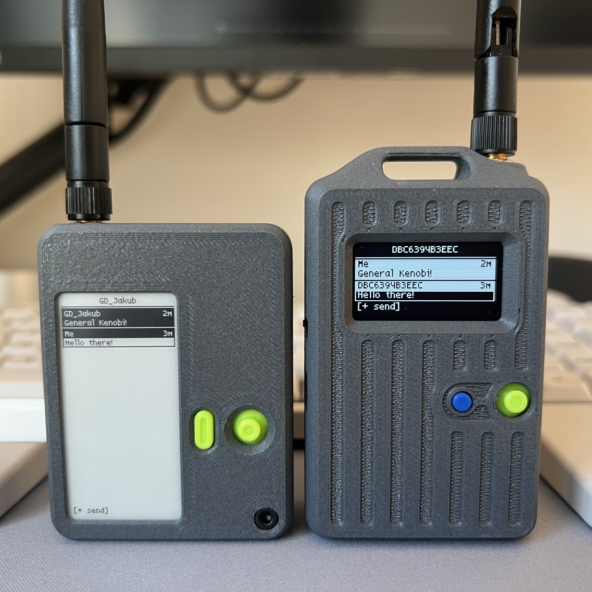

# Wio Tracker L1 — Extended Companion Radio Firmware

This branch extends the official MeshCore companion radio firmware for the **Seeed Wio Tracker L1**.

Join the discussion on offical MeshCore discord: https://discord.gg/sdhYArU2jr



[E-ink case](https://www.printables.com/model/1420534-seeed-wio-tracker-l1-e-ink-enclosure)
[Oled case](https://www.printables.com/model/1380791-meshpack-seeed-l1-oled)

## Firmware Variants

Two firmware builds are published with each release:

| Variant | Display | File |
|---------|---------|------|
| **OLED** | SSD1306 / SH1106 128 × 64 | `WioTrackerL1_companion_dual_*.uf2` |
| **E-ink** | GxEPD2 250 × 122 | `WioTrackerL1Eink_companion_dual_*.uf2` |

Both variants are built from a single codebase and share the same feature set. The `dual` in the filename means a single binary supports both BLE and USB serial — there are no separate BLE/USB builds.

### E-ink Display

The e-ink variant targets the Wio Tracker L1 fitted with a 2.13″ GxEPD2 panel (250 × 122 px). All screens have been adapted for the e-ink panel:

- **Adaptive layout** — every screen reflows correctly in both landscape (250 × 122) and portrait (122 × 250) orientations
- **Display rotation** — configurable in Settings › Display; applied immediately and persisted across reboots
- **Scaled navigation dots** — dot indicators on the home screen scale with line height so they remain visible at all orientations
- **Clock seconds suppressed by default** — seconds are hidden to reduce per-second panel refreshes and extend display lifetime; re-enable in Settings › Display

---

## New Features

### Messages Screen

View and send messages using the on-screen keyboard or predefined quick replies. The keyboard supports placeholders that insert live sensor data — `{time}` and `{loc}` are always available; additional placeholders (`{temp}`, `{hum}`, `{pres}`, `{batt}`, `{alt}`, `{lux}`, `{co2}`) appear automatically for sensors that are connected and returning data.

Each message in the history list shows the sender name and a compact age indicator (`3m`, `2h`, `>1d`) in the top-right corner of the entry.

```
╔══════════════════════════════╗
║          #general            ║
╠══════════════════════════════╣
║▓▓▓▓▓▓▓▓▓▓▓▓▓▓▓▓▓▓▓▓▓▓▓▓▓▓▓▓▓ ║  ← selected
║ Alice                   3m   ║
║ Hey, let's meet tomorrow     ║
║┌───────────────────────────┐ ║
║│▓▓▓▓▓▓▓▓▓ Bob      1h ▓▓▓▓ │ ║
║│ Sure, what time works?    │ ║
║└───────────────────────────┘ ║
║[+ send]                      ║
╚══════════════════════════════╝
```

Press Enter on a message to open it in fullscreen. Navigate between messages with left (newer) and right (older). If the message is a reply addressed to someone (`@[nick]`), a **To: nick** bar is shown below the sender name and the body is displayed without the address prefix.

```
╔══════════════════════════════╗
║▓▓ Alice ▓▓▓▓▓▓▓▓▓▓▓▓▓▓▓▓▓▓▓▓ ║  ← sender
║▓▓ To: Bob ▓▓▓▓▓▓▓▓▓▓▓▓▓▓▓▓▓▓ ║  ← recipient
╠══════════════════════════════╣
║ Hey Bob, let's meet up       ║
║ tomorrow at 6pm downtown.    ║
║ Will you make it?            ║
║                              ║
║< newer                older >║
╚══════════════════════════════╝
```

Hold Enter on a message to open a context menu. From the list or fullscreen view, select **Reply** to pre-fill the keyboard or a quick message with `@[nick]` so the recipient is clearly addressed. The reply picker title shows the recipient's name.

```
╔══════════════════════════════╗
║           RE:Alice           ║
╠══════════════════════════════╣
║> Custom message...           ║
║  OK, I understand            ║
║  On my way                   ║
║  Be right there              ║
╚══════════════════════════════╝
```

On channel or contact list entries, the context menu also lets you change per-channel notification settings (mute, follow global, or force-on), per-channel melody override (follow global, Melody 1, or Melody 2), or mark messages as read.

**Mark all read** — Hold Enter on the DM / Channels / Rooms mode-select screen to clear all unread counters for the highlighted category at once.

### Favourites Dial

A dedicated home page showing a 2×3 grid of pinned contacts. Navigate tiles with the joystick; press Enter on a filled tile to open that contact's DM directly.

```
╔══════════════════════════════╗
║         Favourites           ║
╠══════════════════════════════╣
║ ┌──────┐ ┌──────┐ ┌──────┐   ║
║ │Alice │ │Bob  3│ │  +   │   ║
║ └──────┘ └──────┘ └──────┘   ║
║ ┌──────┐ ┌──────┐ ┌──────┐   ║
║ │Carol │ │  +   │ │  +   │   ║
║ └──────┘ └──────┘ └──────┘   ║
╚══════════════════════════════╝
```

- Unread badge shown on filled tiles
- Enter on an empty tile (`+`) opens a contact picker (upstream-favourited contacts first, then recent DMs)
- **Pin / unpin** — open a DM, then Hold Enter › options menu › "Pin to dial" to choose a slot; selecting a contact already pinned elsewhere moves it to the new slot
- LEFT/RIGHT in the Home Pages settings reorders the Favourites page in the navigation sequence

### Settings Screen

All settings are saved to flash and restored on next boot. Settings are organised into collapsible sections — press Enter on a section header to expand or collapse it. All sections start collapsed for faster navigation.

- **Display**
  - Brightness
  - Auto-off timeout
  - Battery display mode (icon, %, V)
  - Clock seconds (show/hide — hiding reduces display refresh from 1 s to 60 s)
  - Clock format (12 h / 24 h)
  - Font — **Default** (5×7 Adafruit, ASCII + transliteration) or **Lemon** (native Unicode, pixel-accurate wrap)
  - Display rotation *(e-ink only)* — 0 ° / 90 ° / 180 ° / 270 °; applied immediately
  - Joystick rotation *(e-ink only)* — rotates the joystick input mapping independently of the display rotation; useful when mounting the device in a custom enclosure
  - Full refresh interval *(e-ink only)* — how many partial refreshes before a cleansing full refresh (off / 5 / 10 / 20 / 30); reduces ghosting on long sessions
- **Sound**
  - Buzzer: On / Off / **Auto** — Auto mode silences the device while connected via Bluetooth, and re-enables sound when the connection drops
  - Volume (1–5; preview tone plays on each change)
  - DM Melody — notification sound for incoming private messages: built-in, Melody 1, or Melody 2
  - Channel Melody — notification sound for incoming channel messages: built-in, Melody 1, or Melody 2
- **Home Pages** — toggle visibility and reorder individual home screen pages; press LEFT / RIGHT on any entry to move it earlier or later in the navigation sequence; press ENTER to toggle ON / OFF (Settings and Messages are always visible and cannot be disabled)
- **Radio**
  - TX power
- **System**
  - Timezone (UTC offset in hours)
  - Low battery shutdown threshold
  - Auto-lock — automatically locks the device when the display turns off
- **Contacts**
  - Show all DMs or favourites only
  - Show all room servers or favourites only
- **Messages**
  - Edit up to 10 quick reply templates (Q1–Q10)

### Clock Screen

A dedicated clock page on the home screen shows the current time and date, synchronized from GPS or via Bluetooth. Timezone offset is applied from Settings.

Up to three configurable data fields are displayed below the clock. Available fields: battery voltage, temperature, humidity, pressure, GPS coordinates, altitude, luminosity, CO₂, contact count, and total unread message count.

### Screen Lock

Hold **Back** and press **Enter** three times to lock or unlock the device. While locked:

- The display turns off and ignores incoming keypresses
- A brief button press shows the lock screen: current time, date, and up to two sensor values (reuses the Dashboard Config fields)
- A hint popup guides through the unlock sequence
- **Auto-lock** (configurable in Settings → System) locks automatically when the display turns off

### Nearby Nodes

Browse nodes that have recently advertised on the mesh. Filter by category (Favourites, All, Companion, Repeater, Room, Sensor). Select a node to see its coordinates, distance, bearing with cardinal direction, type, and last-heard time.

```
╔══════════════════════════════╗
║▓▓▓▓▓ WioTracker-Alice ▓▓▓▓▓▓ ║  ← node name
╠══════════════════════════════╣
║ Lat: 50.06190                ║
║ Lon: 19.94090                ║
║ Dist: 2.3km                  ║
║ Az: 145d (SE)                ║
║ Type: Companion              ║
║ Seen: 5m ago                 ║
╚══════════════════════════════╝
```

Use **Send my advert** (hold Enter → context menu) to broadcast your position and prompt nearby nodes to respond with theirs.

#### Active Discovery

Press **Enter** from the Nearby screen to send a live `NODE_DISCOVER_REQ` ping. All reachable repeaters, sensors and room servers within zero-hop range respond immediately with their name, type and signal data. Results appear as 2-line boxed cards with RSSI, SNR and the remote SNR (signal quality at the responder's end).

```
╔═══════════════════════════════╗
║▓▓▓▓▓▓▓ DISCOVER (2 found) ▓▓  ║
╠═══════════════════════════════╣
║▓▓▓▓▓▓▓▓▓▓▓▓▓ Rptr-A   Rpt ▓▓▓▓║  ← selected
║▓▓▓▓▓▓▓▓ RSSI:-79 SNR:9 ▓▓▓▓▓▓▓║
║┌────────────────────────────┐ ║
║│▓▓▓▓▓▓▓▓▓▓▓▓ Sensor-B  Snsr │ ║
║│ RSSI:-94 SNR:3             │ ║
║└────────────────────────────┘ ║
╚═══════════════════════════════╝
```

Navigate with **UP/DOWN**. Press **Enter** on a node to open a full-screen detail view showing the public key, RSSI, SNR, remote SNR and whether the node is already in your contacts.

Hold **Enter** from the discovery list to rescan. Press **Cancel** or **Back** to return.

### Tools Screen

#### GPS Trail

Records your route in a RAM ring buffer (up to 512 points). Sampling runs in the background whenever tracking is active — a blinking **G** indicator appears in the status bar. The trail survives display auto-off but is lost on reboot unless saved to flash first.

Three views cycle with **LEFT / RIGHT**:

| View | Content |
|------|---------|
| **Summary** | Total distance, elapsed time, avg speed or pace, point count, tracking status |
| **Map** | Auto-fit dot-and-line plot with cos(lat) aspect correction; segment breaks marked with open/filled dots; north arrow; scale grid (toggle with Enter) |
| **List** | Per-point rows showing local time (HH:MM) and delta distance from the previous point; segment-start rows show `start` |

**Hold Enter** opens the action menu:

| Item | Action |
|------|--------|
| Min dist | Cycle min-distance gate: 5 m / 10 m / 25 m / 100 m (LEFT/RIGHT while focused) |
| Units | Cycle speed/pace units: km/h / mph / min/km / min/mi (LEFT/RIGHT while focused) |
| Start / Stop tracking | Begin or end a recording session |
| Save trail | Write the current RAM ring to flash (`/trail`) |
| Load trail | Restore the saved flash trail into RAM |
| Export GPX | Stream the live RAM trail as GPX 1.1 over USB Serial |
| Export saved | Stream the saved flash trail as GPX 1.1 over USB Serial without loading it into RAM |
| Reset trail | Clear the RAM ring and elapsed time |

#### Downloading GPX to your computer

1. Connect the device to your computer with a USB cable.
2. Open a serial terminal at **115200 baud** on the device's serial port:
   - **macOS / Linux** — `screen /dev/tty.usbmodem* 115200` or `cat /dev/tty.usbmodem*` (replace with your port, e.g. `/dev/ttyACM0` on Linux); to save directly to a file use `cat /dev/tty.usbmodem* > track.gpx` and stop with Ctrl-C after the dump completes
   - **Windows** — open PuTTY (Connection type: Serial, Speed: 115200), or use Arduino IDE › Tools › Serial Monitor (set line ending to "No line ending")
3. On the device, navigate to **Tools › Trail**, then **Hold Enter** and select **Export GPX** (live ring) or **Export saved** (flash slot).
4. The device streams a GPX 1.1 XML document to the serial port. Copy the output starting from `<?xml` to `</gpx>` and save it as a `.gpx` file.
5. Import the file into any GPX-compatible application — OsmAnd, Garmin BaseCamp, GPX Studio, Google Earth, etc.

> **Note:** If the companion app is connected over **BLE**, the export is safe — the app ignores USB input while BLE is active and the device alert will read *"GPX N B (USB)"*. If you are using the app over **USB**, disconnect from the app first before exporting; the raw XML stream will otherwise disrupt the app's serial framing. The alert *"GPX N B - disc. app"* indicates no BLE link was detected and serves as a reminder to reconnect the app afterwards.

#### Auto-Advert

Periodically broadcasts a 0-hop advert with your GPS position so nearby nodes can track your location automatically. Configurable interval: off / 30 s / 1 min / 2 min / 5 min / 10 min / 30 min / 1 h.

A blinking **A** indicator appears in the status bar while Auto-Advert is active.

#### Ringtone Editor

A step sequencer for composing custom notification melodies stored on the device. Two independent melody slots are available — **Melody 1** and **Melody 2** — switchable from within the editor. Each melody supports up to 32 notes with adjustable pitch (C–B + pause), octave (4–7), duration (1/4 / 1/8 / 1/16 / 1/32), and BPM (60 / 90 / 120 / 150 / 180). Playback preview is available directly from the editor.

Melodies can be assigned as notification sounds per message type (DM / channel) in Settings, and individually overridden per channel or per contact from the message screen context menu.

#### Auto-Reply Bot

Automatically replies to incoming messages that contain a configured trigger word (case-insensitive).

- **DM mode** — when enabled, the bot listens to all incoming private messages and replies with the DM reply text.
- **Channel mode** — optionally, select a channel for the bot to monitor. When a trigger is matched, it replies with a separate channel reply text.
- Both modes can be active simultaneously and share the same trigger word but use independent reply texts.
- Replies support placeholders (`{time}`, `{loc}`).
- A 10-second cooldown prevents repeated replies in quick succession.

---

## Font Switcher

Both the default font and the [Lemon bitmap font](https://github.com/cmvnd/fonts) are built into every firmware variant. Switch between them at runtime in **Settings → Display → Font** — no reflashing required. The selected font is saved to flash and takes effect immediately.

The Lemon font offers:

- **Native Unicode rendering** — Latin Extended, Greek, and Cyrillic characters (U+0020–U+04FF) are displayed directly without transliteration, covering Polish, Czech, Slovak, German, French, Scandinavian, Hungarian, Romanian, Croatian, Turkish, Baltic, Russian, and Greek scripts.
- **Pixel-accurate word wrap** — text wraps based on actual glyph widths rather than a fixed character count.
- **Slightly taller glyphs** — the font uses a 9 px line height on OLED and 10 px on e-ink, compared to 8 px for the default font on both displays.

---

Feel free to explore, share feedback and feature requests!

## Development

This fork tracks the upstream [MeshCore](https://github.com/ripplebiz/MeshCore) repository. To prevent upstream changes from overwriting this README during merges, `README.md` is protected via `.gitattributes`. After cloning, run once:

```sh
git config merge.ours.driver true
```
