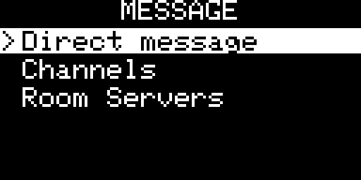
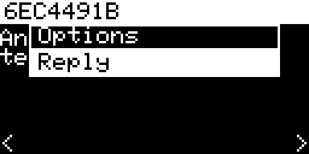

## Messages Screen
[Go back](../README.md)

### Overview

| OLED | E-Ink |
|:----:|:-----:|
|  | |

The Messages screen is split into three modes — **DMs**, **Channels**, and **Rooms** — selectable with UP/DOWN on the mode-select screen. Each mode shows the corresponding list of conversations with unread counters.

---

### Sending messages

| OLED | E-Ink |
|:----:|:-----:|
|  | |

Press **Enter** on a contact or channel to open its history, then press **Enter** again (or select an empty send row) to compose a message. Choose between:

- **Custom message** — opens the on-screen keyboard
- **Q1–Q10** — quick reply templates editable in Settings › Messages

The keyboard supports placeholders that insert live data at send time:

| Placeholder | Value | Availability |
|-------------|-------|--------------|
| `{time}` | current time (HH:MM) | always |
| `{loc}` | GPS coordinates | always ("no GPS" if no fix) |
| `{temp}` | temperature | sensor connected |
| `{hum}` | humidity | sensor connected |
| `{pres}` | barometric pressure | sensor connected |
| `{alt}` | altitude | sensor connected |
| `{lux}` | luminosity | sensor connected |
| `{co2}` | CO₂ concentration | sensor connected |

Sensor placeholders appear automatically in the placeholder picker when the corresponding sensor is active. `{time}` and `{loc}` are always shown.

---

### Message history

| OLED | E-Ink |
|:----:|:-----:|
|  | |

Each entry in the history list shows the sender name and a compact age indicator (`3m`, `2h`, `>1d`) in the top-right corner.

**Short Enter** on a message opens it in fullscreen. **Hold Enter** opens the context menu (Reply option).

---

### Fullscreen message view

| OLED | E-Ink |
|:----:|:-----:|
|  | |

Navigate between messages with **LEFT** (newer) and **RIGHT** (older). Long messages scroll with **UP/DOWN**.

If the message is a reply addressed to someone (`@[nick]`), a **To: nick** bar is shown below the sender name and the body is displayed without the address prefix.
| OLED | E-Ink |
|:----:|:-----:|
|  | |
**Hold Enter** in fullscreen opens the Reply option.

---

### Context menu — contact list

**Hold Enter** on a contact entry opens a context menu:
| OLED | E-Ink |
|:----:|:-----:|
|  | |

| Item | Action |
|------|--------|
| Mark as read | Clears unread counter for this contact |
| Notif: default / OFF / ON | Per-contact notification override — **LEFT/RIGHT** to cycle |
| Melody: global / M1 / M2 | Per-contact melody override — **LEFT/RIGHT** to cycle |
| Pin to dial / Unpin (slot N) | Pin this contact to a Favourites Dial slot; if already pinned shows which slot |

When **Pin to dial** is selected, a slot picker opens (Slot 1–6 showing current occupant name or "empty"). Choosing a slot that already holds another contact moves the new contact there.

---

### Context menu — channel list

| OLED | E-Ink |
|:----:|:-----:|
|  | |

**Hold Enter** on a channel entry opens a context menu:

| Item | Action |
|------|--------|
| Mark all read | Clears all unread for this channel |
| Notif: default / OFF / ON | Per-channel notification override — **LEFT/RIGHT** to cycle |
| Melody: global / M1 / M2 | Per-channel melody override — **LEFT/RIGHT** to cycle |
| Fav: yes / no | Add or remove this channel from favourites — **LEFT/RIGHT** to toggle |

---

### Mark all read

**Hold Enter** on the DM / Channels / Rooms mode-select screen to clear all unread counters for the highlighted category at once.
