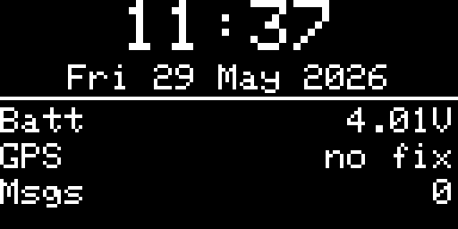
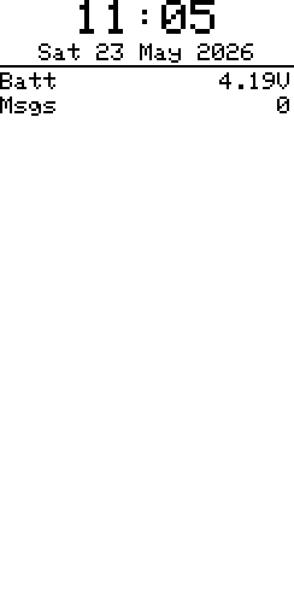
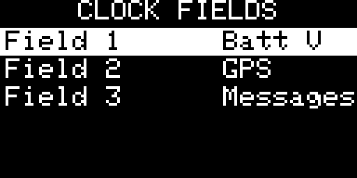
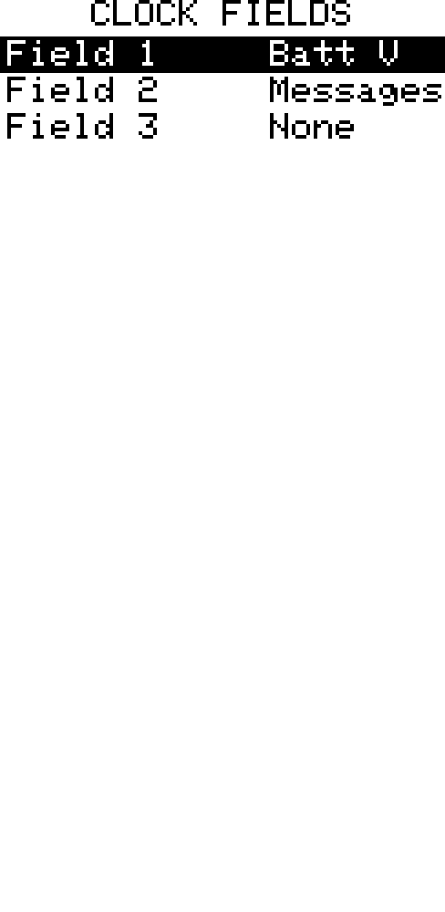

## Clock Screen

[Go back](../../../README.md)

### Overview

|           OLED            |           E-Ink           |
| :-----------------------: | :-----------------------: |
|  |  |

A full-screen clock page on the home screen. Shows the current time and date, with up to three configurable data fields below.

When the Clock page is enabled, pressing **Cancel/Back** on any other home
carousel page returns directly to Clock. Cancel still closes an active popup
before this shortcut is applied.

Time is synchronized from GPS or via the companion app. While the clock remains unsynchronised, a GPS receiver configured off is temporarily retried once per hour for up to five minutes, then powered down again between attempts. Timezone offset is applied from **Settings › System**.

If no time source is available, the screen shows _"! No time sync"_ with a hint to enable GPS or connect the app.

---

### Time display

- **Format** — 24 h or 12 h with AM/PM; configurable in **Settings › Display**
- **Seconds** — shown by default on OLED; hidden on e-ink (always) and optionally on OLED via **Settings › Display › Clock seconds**; hiding reduces the refresh rate from 1 s to 60 s

---

### Data fields

|           OLED            |           E-Ink           |
| :-----------------------: | :-----------------------: |
|  |  |

Up to three data fields are shown below the date separator. Each field displays a label and a value on the same line.

| Field       | Label | Value                                                                     |
| ----------- | ----- | ------------------------------------------------------------------------- |
| None        | —     | —                                                                         |
| Batt V      | Batt  | Battery voltage (e.g. `3.92V`)                                            |
| Batt %      | Batt  | Battery percentage using LiPo curve anchored at the low-battery threshold |
| Temperature | Temp  | °C from onboard sensor                                                    |
| Humidity    | Hum   | % from onboard sensor                                                     |
| Pressure    | Pres  | hPa from onboard sensor                                                   |
| GPS         | GPS   | `lat lon` decimal degrees, or `no fix`                                    |
| Altitude    | Alt   | metres from onboard sensor (GPS or barometric)                            |
| Luminosity  | Lux   | lux from onboard sensor                                                   |
| CO₂         | CO2   | ppm from onboard sensor                                                   |
| Contacts    | Nodes | Total contacts in the mesh                                                |
| Messages    | Msgs  | Total unread message count                                                |

Sensor fields show `--` when the sensor is not connected or has no data.

---

### Configuring fields

|           OLED            |           E-Ink           |
| :-----------------------: | :-----------------------: |
|  |  |

<!-- screenshot pending: Dashboard Config — three field slots cycled with LEFT/RIGHT -->

**Hold Enter** (or press the **Context menu** key) on the Clock page to open the Dashboard Config screen, where each of the three field slots can be cycled with **LEFT/RIGHT**.

---

### Clock tools

Alarm, Timer and Stopwatch are not included in this focused build.
---

## Boot time synchronisation

After every boot the Clock page shows **SYNC** until an authoritative live time
update arrives from GPS, a companion connection or another network source. If
GPS is configured off, the firmware powers it temporarily in the background,
requests a time update, then powers it off again after synchronisation. A
five-minute GPS timeout prevents an indoor device from leaving the receiver on
indefinitely; **SYNC** remains until another source supplies the time.

Only the clock and date region is replaced by **SYNC**. The horizontal separator
and all three configured dashboard fields remain visible and continue updating.
