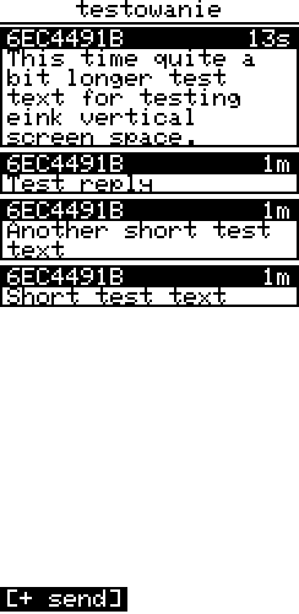
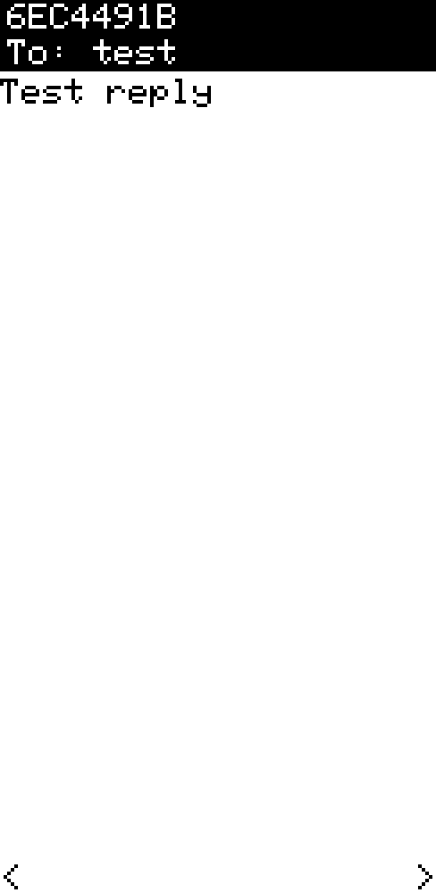
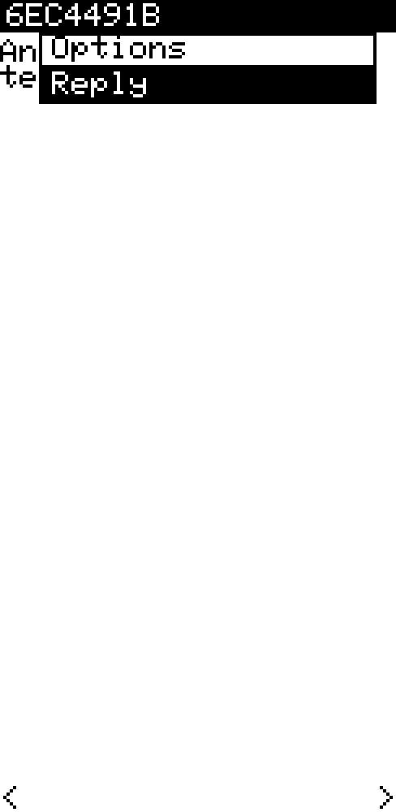

## Messages Screen

[Go back](../../../README.md)

### Overview

|           OLED            |           E-Ink           |
| :-----------------------: | :-----------------------: |
|  |  |

The Messages screen is split into three modes — **DMs**, **Channels**, and **Rooms** — selectable with UP/DOWN on the mode-select screen. Each mode shows the corresponding list of conversations with unread counters.

---

### Sending messages

|           OLED            |           E-Ink           |
| :-----------------------: | :-----------------------: |
|  |  |

Press **Enter** on a contact or channel to open its history, then press **Enter** again (or select the **[+ send]** button, anchored at the right edge of the history) to compose a message. Choose between:

- **Custom message** — opens the on-screen keyboard
- **Q1–Q10** — quick reply templates editable in Settings › Messages

While typing, **Hold Enter** enters cursor mode (LEFT/RIGHT move the insertion point, UP/DOWN jump to start/end, Enter/Cancel exit) so you can edit or insert in the middle of what you've typed instead of only at the end — see the on-screen keyboard section of the [UI framework guide](../../design/solo_ui_framework.md) for the full key set (Shift, T9 multi-tap, alternate alphabets).

The keyboard supports placeholders that insert live data at send time:

| Placeholder | Value                | Availability                |
| ----------- | -------------------- | --------------------------- |
| `{time}`    | current time (HH:MM) | always                      |
| `{loc}`     | GPS coordinates      | always ("no GPS" if no fix) |
| `{temp}`    | temperature          | sensor connected            |
| `{hum}`     | humidity             | sensor connected            |
| `{pres}`    | barometric pressure  | sensor connected            |
| `{alt}`     | altitude             | sensor connected            |
| `{lux}`     | luminosity           | sensor connected            |
| `{co2}`     | CO₂ concentration    | sensor connected            |

Sensor placeholders appear automatically in the placeholder picker when the corresponding sensor is active. `{time}` and `{loc}` are always shown.

---

### Rooms — logging in

Posting to a **room server** requires a login handshake first, so the device can log in on its own — no phone app needed. The first time you press **Enter** on a room, a password prompt opens automatically; type the room's password and press the **✓** key (leave it empty and submit for open / no-password rooms). Once the login succeeds the room's chat **opens automatically** — no second Enter needed (as long as you're still on that room in the list).

- **Passwords are remembered across reboots.** After a successful login the password is saved on the device, so picking that room again — even after a power cycle — logs back in silently and drops you straight into the chat.
- **A wrong or changed password self-heals.** If a saved password stops working (e.g. the server's password was changed), the failed login forgets it, so the next **Enter** prompts you to type a new one.
- **Re-login any time** with **Hold Enter** on the room → **Login…** (see the room context menu below) — useful to switch to a new password without waiting for a failure.
- **Log out** with **Hold Enter** on a room you're currently logged into → **Logout** (only offered once logged in). Forgets the saved password on the device, so the next time you open that room it prompts for one again instead of silently reusing the old one.
- Passwords set from the **phone app** are saved on the device too, so it can post to that room standalone after a reboot.

> The on-screen keyboard's default (Latin) page is ASCII only. Typing accented or non-Latin characters — Polish, Czech, Slovak, German, French, Spanish, Portuguese or Nordic diacritics, Cyrillic, or Greek — needs Settings › Keyboard › Alphabet set to the matching language first; the keyboard's **#@/abc** key then cycles Latin → that alphabet → Symbols → Latin. A password containing characters outside whatever's currently enabled can still be set from the phone app — the device stores and replays it byte-for-byte.

---

### Message history

|           OLED            |           E-Ink           |
| :-----------------------: | :-----------------------: |
|  |  |

Messages are drawn as chat bubbles sized to fit their content, anchored **right** for your own outgoing messages and **left** for incoming ones (like a typical messenger), with the sender name and a compact age indicator (`3m`, `2h`, `>1d`) in the top-right corner of each bubble. The list runs **newest at the bottom** — opening a history starts you at the latest message, and scrolling **up** goes further into the past.

**Short Enter** on a message opens it in fullscreen. **Hold Enter** — on a history row or in fullscreen — opens the same options menu: Reply, plus **Navigate** / **Save waypoint** when the message contains a location (see Fullscreen message view). You don't need to open the message first.

---

### Fullscreen message view

|           OLED            |           E-Ink           |
| :-----------------------: | :-----------------------: |
|  |  |

Navigate between messages with **LEFT** (newer) and **RIGHT** (older). Long messages scroll with **UP/DOWN**.

If the message is a reply addressed to someone (`@[nick]`), a **To: nick** bar is shown below the sender name and the body is displayed without the address prefix.

|           OLED            |           E-Ink           |
| :-----------------------: | :-----------------------: |
|  |  |

**Hold Enter** in fullscreen opens the options menu. It always offers **Reply** for an incoming message, and when the message contains a **location** it adds two more:

- **Navigate** — opens the bearing/distance view to those coordinates (the same two-bearing screen as Waypoints and Nearby; **Back** returns to the message).
- **Save waypoint** — stores the location as a waypoint (visible on the trail map and in the Waypoints list).

A location is any `lat,lon` pair in the text — exactly what the `{loc}` placeholder inserts — so you can navigate to anything a contact shares. A `[WAY]lat,lon label` share also carries a name, used as the waypoint label. This works on DMs and channel messages, incoming or outgoing.

---

### Context menu — contact list

**Hold Enter** on a contact entry opens a context menu:

|           OLED            |           E-Ink           |
| :-----------------------: | :-----------------------: |
|  |  |

| Item                         | Action                                                                         |
| ---------------------------- | ------------------------------------------------------------------------------ |
| Mark as read                 | Clears unread counter for this contact                                         |
| Notif: default / OFF / ON    | Per-contact notification override — **LEFT/RIGHT** to cycle                    |
| Melody: global / M1 / M2     | Per-contact melody override — **LEFT/RIGHT** to cycle                          |
| Pin to dial / Unpin (slot N) | Pin this contact to a Favourites Dial slot; if already pinned shows which slot |

When **Pin to dial** is selected, a slot picker opens (Slot 1–6 showing current occupant name or "empty"). Choosing a slot that already holds another contact moves the new contact there.

In the **Rooms** list the context menu instead offers:

| Item    | Action                                                                       |
| ------- | ---------------------------------------------------------------------------- |
| Login…  | Opens the password prompt to (re-)log in to this room (see Rooms — logging in) |
| Logout  | Only shown once logged in. Forgets the saved password so the next open prompts for one again |

---

### Context menu — channel list

|           OLED            |           E-Ink           |
| :-----------------------: | :-----------------------: |
|  |  |

**Hold Enter** on a channel entry opens a context menu:

| Item                      | Action                                                                |
| ------------------------- | --------------------------------------------------------------------- |
| Mark all read             | Clears all unread for this channel                                    |
| Notif: default / OFF / ON | Per-channel notification override — **LEFT/RIGHT** to cycle           |
| Melody: global / M1 / M2  | Per-channel melody override — **LEFT/RIGHT** to cycle                 |
| Fav: yes / no             | Add or remove this channel from favourites — **LEFT/RIGHT** to toggle |
| Edit                      | Opens the Add/Edit form below, pre-filled with the channel's name    |
| Delete                    | Removes the channel immediately (no confirm prompt)                   |

---

### Adding / editing a channel

Joining a new community channel, or creating one to share with others, no longer needs the phone app. The **Channels** list ends with a **"+ Add channel"** row — press **Enter** on it to open the form, or use **Edit** from the context menu above to change an existing channel's name or secret.

| Field  | Notes                                                                                        |
| ------ | ---------------------------------------------------------------------------------------------- |
| Name   | Up to 31 characters                                                                            |
| Secret | **LEFT/RIGHT** toggles between two entry modes; **Enter** opens the keyboard for whichever is selected |

- **Passphrase** (default) — type any text; the device hashes it down to the channel's 16-byte secret. Easiest to agree on verbally, the same idea as a room password — two people who type the same passphrase end up on the same channel.
- **Hex key** — type the exact 32-hex-character secret (the format used by channel QR codes, see [QR Codes](../../qr_codes.md)), for joining a channel whose precise secret you were given rather than agreeing on a new passphrase. An all-zero secret (`00…0`) is rejected ("Invalid secret") — that value is reserved internally to mark an empty channel slot.

Select **[Save]** to commit. The secret can't be redisplayed once saved (only the derived key is kept) — editing it later means typing a new passphrase or hex key, the same as re-logging into a room with a new password.

---

### Mark all read

**Hold Enter** on the DM / Channels / Rooms mode-select screen to clear all unread counters for the highlighted category at once.
