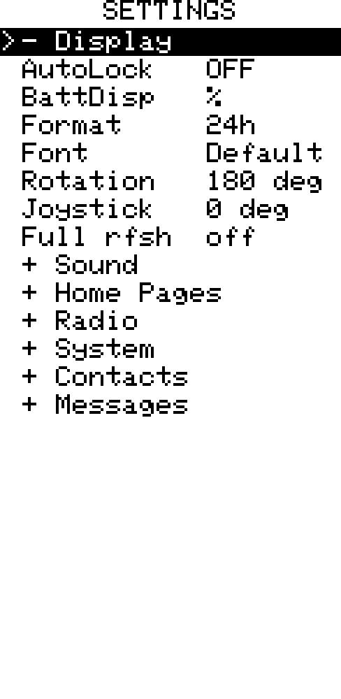
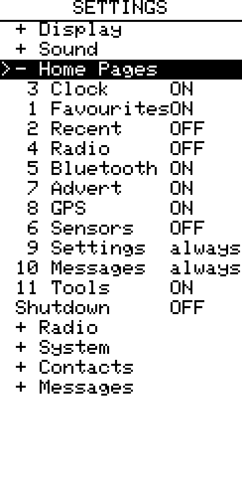

## Settings Screen

[Go back](../../../README.md)

### Overview

|           OLED            |           E-Ink           |
| :-----------------------: | :-----------------------: |
|  |  |

All settings are saved to flash and restored on next boot. The Settings home card lists the available sections directly. Use **UP/DOWN** to select a section and press **Enter** to open its dedicated screen. Only that section's settings are shown; the old collapsible `+`/`-` section list is not used. Press **LEFT/RIGHT** to change a value, or **Enter** for toggle items.

Press **Cancel/Back** to save and return to the home screen. Settings are written
only if their final values differ from those present when Settings was opened;
cycling a value back to its original choice does not cause a flash write.

---

### Display

| Setting                              | Options                          | Notes                                                                                                 |
| ------------------------------------ | -------------------------------- | ----------------------------------------------------------------------------------------------------- |
| Brightness                           | 1–5                              | LEFT/RIGHT; preview applies immediately                                                               |
| Auto-off                             | 5 s / 15 s / 30 s / 60 s / never | LEFT/RIGHT                                                                                            |
| Auto-lock                            | on / off                         | Locks device when display turns off                                                                   |
| Battery                              | icon / % / V                     | Display mode for the top-bar battery indicator                                                        |
| Clock seconds                        | show / hide                      | Hiding reduces OLED refresh from 1 s to 60 s                                                          |
| Clock format                         | 24 h / 12 h                      | 12 h appends AM/PM                                                                                    |
| Display rotation _(e-ink only)_      | 0° / 90° / 180° / 270°           | Applied immediately                                                                                   |
| Joystick rotation _(e-ink only)_     | 0° / 90° / 180° / 270°           | Rotates input mapping independently of display rotation; useful for custom enclosures                 |
| Full refresh interval _(e-ink only)_ | off / 5 / 10 / 20 / 30           | Partial refreshes between full clears; reduces ghosting on long sessions                              |

---

### Sound

| Setting        | Options                        | Notes                                                        |
| -------------- | ------------------------------ | ------------------------------------------------------------ |
| Buzzer         | On / Off / Auto                | Auto: silences while BLE connected, re-enables on disconnect |
| Volume         | 1–5                            | LEFT/RIGHT; preview tone plays on each change                |
| DM Melody      | built-in / Melody 1 / Melody 2 / None | Notification sound for incoming private messages. `None` disables the sound for this event. |
| Channel Melody | built-in / Melody 1 / Melody 2 / None | Notification sound for incoming channel messages. `None` disables the sound for this event. |
| AD sound       | built-in / Melody 1 / Melody 2 / None | Sound played whenever an **advert** is received from *any* node — pairs with automatic adverts as an audible "in range" heartbeat. `None` disables the sound for this event. |
| AD scope       | All / Zero-hop                | Filters the AD sound so it plays for every advert or only for local zero-hop adverts. |
| Quiet Time     | Off / On / Active             | Enables the daily schedule; Active means the current local time is inside it |
| Quiet from     | 21:00                         | Start of Quiet Time in the configured local timezone |
| Quiet until    | 07:00                         | End of Quiet Time in the configured local timezone |

Melody 1 and Melody 2 are custom sequences editable in **Tools › Ringtone Editor**.

### Advert

Advert has its own entry on the Settings home card.

| Setting     | Options                         | Notes |
| ----------- | ------------------------------- | ----- |
| Auto Advert | Off / 1 hour / 3 hours / 6 hours | Periodically sends a zero-hop advert so nearby nodes can discover this device. |
| GPS Details | Hide / Share                    | Controls whether coordinates are included in every self advert, including automatic adverts and adverts triggered manually on the device or by a companion app. |

See [Quiet Time](../quiet_time/quiet_time.md) for schedule behaviour and time editing.

---

### Home Pages

|           OLED            |           E-Ink           |
| :-----------------------: | :-----------------------: |
|  |  |

Lists the configurable home screen pages. For each entry:

- **LEFT / RIGHT** — move the page earlier or later in the navigation sequence
- **Enter** — toggle the page ON / OFF

**Clock** is always the first home screen and is not shown in this list.
**Settings** and **Messages** are always visible and cannot be disabled.
Position numbers begin at **1** for the first configurable page after Clock.

---

### Radio

| Setting   | Options    | Notes                                                                                                                                                              |
| --------- | ---------- | ------------------------------------------------------------------------------------------------------------------------------------------------------------------ |
| TX Pwr    | 2–22 dBm   | LEFT/RIGHT. With **Auto pwr** on this is the *ceiling* — the radio may transmit lower. |
| Preset    | named presets | LEFT/RIGHT cycles community RF presets (region frequency + bandwidth/SF/CR). **Enter** opens a popup to pick one, save the current settings as a named preset, or delete a saved one. Applies frequency, bandwidth, SF and CR together. |
| Freq      | chip range | **Enter** opens a digit-by-digit editor: LEFT/RIGHT moves between decimal places, UP/DOWN steps that digit. Bounds come from the radio chip's own validated range, so a value the radio would reject can't be entered. |
| SF        | 5–12       | LEFT/RIGHT. Spreading factor. |
| BW        | 7.8–500 kHz | LEFT/RIGHT cycles the standard LoRa bandwidths. |
| CR        | 5–8        | LEFT/RIGHT. Coding rate (4/5–4/8). |
| Auto pwr  | ON / OFF   | **Adaptive Power Control.** Lowers actual TX power on strong links to save energy, ramping back up — to the **TX Pwr** ceiling — on weak or lost links. Link quality comes from direct-message ACK SNR and, for channel messages (no ACK), from hearing a repeater rebroadcast your packet. The radio page / name bar shows the live power. Default OFF (fixed TX power). **Suppressed (shown as `--`) while the repeater is on** — a repeater holds full TX power for consistent relay reach; your setting is restored when the repeater is switched off. |

|           OLED            |           E-Ink           |
| :-----------------------: | :-----------------------: |
|  |  |

<!-- screenshot pending: Radio — preset popup (pick/save/delete) and/or the digit-by-digit frequency editor -->

The **repeater** mode and radio timing controls live on their own screen — see **Tools › Repeater**.

---

### System

| Setting     | Options                                             | Notes                                                                                  |
| ----------- | --------------------------------------------------- | -------------------------------------------------------------------------------------- |
| Name        | keyboard entry (up to 31 chars)                     | This device's node name, shown to others and in every advert. **Enter** opens the keyboard pre-filled with the current name; applied and saved on submit |
| Timezone    | −12 h … +14 h                                       | UTC offset in whole hours                                                              |
| GPS         | OFF / Continuous / 2 min / 5 min / 15 min / 30 min / 1 h / 3 h / 6 h | Continuous keeps the receiver on. Timed modes wake it to acquire and stabilise a fix, cache the position/time, then power it down until the selected interval |
| Bluetooth   | ON / OFF                                            | Persistently enables or disables Bluetooth; the USB companion interface is unaffected   |
| Low battery | off / 3.0 V / 3.1 V / 3.2 V / 3.3 V / 3.4 V / 3.5 V | Auto-shutdown threshold; also sets the 0 % anchor for the battery percentage indicator |
| Units       | Metric / Imperial                                   | Unit system for distance values shown by supported screens such as Nearby Nodes. Metric uses m/km; Imperial uses ft/mi. |
| Reboot      | action (**Enter**)                                  | Restarts this device. Pending setting changes are saved first. Last row, so it isn't the default-selected one |

GPS selections made here remain staged while Settings is open. Pressing
**Cancel/Back** applies the selected mode and saves it, so cycling the choices
does not repeatedly reconfigure the receiver or display GPS alert popups.

The GPS home card shows the selected operating mode and whether the receiver is
searching, has a fix, or is sleeping. Press **Enter** on that card to cycle the
same modes. A timed interval begins after the previous acquisition finishes;
the last valid coordinates remain available while the receiver sleeps.

---

### Keyboard

| Setting  | Options    | Notes                                                                                              |
| -------- | ---------- | -------------------------------------------------------------------------------------------------- |
| Layout   | ABC / T9   | English on-screen keyboard style; default **T9**. **ABC** provides one key per letter. In message fields, **T9** predicts words from phone-keypad digit sequences; literal fields retain traditional multi-tap. CardKB remains direct QWERTY. |
| CardKB | Found / Missing | Read-only boot detection and connection status for an optional Grove CardKB |

Applies to every on-screen text field (messages, waypoint labels, room passwords, preset names). Earlier releases labelled the grid *QWERTY*; the layout has always been alphabetical, so it is now named **ABC**.

Message composition also provides a small common-word completion dictionary.
In the Full editor, the best match is shown as uncommitted text after the
underscore cursor (for example, `hel_lo`). In Compact CardKB mode the hint shows
comma-separated candidates, clipped at the display edge when the final word
does not fit.
Type the beginning of a word, then open the `{}` picker (or press **Tab** on
CardKB) to see up to eight matches under **Complete:**. Selecting one replaces
the whole word at the cursor. Completion is deliberately limited to message
text; passwords, names and configuration fields are never suggested or
modified. The dictionary contains 2,500 frequency-ranked conversational words,
based on the SUBTLEX-US spoken-English corpus with a 130-entry Australian
localisation layer covering spellings and everyday vocabulary. Proper names,
corpus fragments, profanity and explicit adult or violent terms are excluded.

With the full on-screen **T9** layout, pressing keys 2–9 builds a predictive
digit sequence and displays the highest-ranked matching word immediately. The
`{}` picker shows up to eight alternatives. Space, Done, cursor movement, a
page change or choosing an alternative commits the provisional word;
Backspace removes the latest digit. The page key cycles **T9 → #@ → abc → T9**,
where `abc` is traditional multi-tap for spelling words outside the dictionary.
Key 1 and the symbols page also retain multi-tap. Predictive entry is limited
to message text; names, passwords and other literal fields always use
multi-tap in T9 layout. CardKB remains direct QWERTY input in either setting.

European Latin-diacritic letters remain available through **Hold Enter** on a plain Latin letter that has accented variants (`a c d e i l n o r s t u y z`). This opens a one-row popup of its accents (e.g. holding `a` offers `á à â ã ä å ą`); **LEFT/RIGHT** picks, **Enter** inserts it, and **Cancel** dismisses it.

See [CardKB](../cardkb/cardkb.md) for connection, controls and polling behaviour.

---

### Contacts

| Setting  | Options          | Notes                                                |
| -------- | ---------------- | ---------------------------------------------------- |
| DMs      | all / favourites | `all` shows every eligible direct-message contact; `favourites` shows only upstream-starred eligible DM contacts. Rooms and repeaters remain in their own lists |
| Channels | all / favourites | Show all channels or only favourited ones            |
| Rooms    | all / favourites | Show all room servers or only favourited ones        |

---

### Child Mode

| Setting    | Options  | Notes                                                                    |
| ---------- | -------- | ------------------------------------------------------------------------ |
| Enabled    | ON / OFF | Enables the restricted interface; requires a saved PIN and confirmation  |
| Set PIN    | 000000–999999 | Enter the six-digit parent PIN twice; the saved value is not displayed |
| Channels   | ON / OFF | Shows favourited private channels in Messages; Public and # channels remain hidden; default OFF |
| Favourites | ON / OFF | Allows the Favourites Dial; default ON                                   |

While Child Mode is locked, selecting Settings opens the parent PIN prompt. A successful PIN entry temporarily restores the full Settings screen and companion access. Leaving Settings or allowing the display to sleep ends the parent session.

See [Child Mode](../child_mode/child_mode.md) for preparation, restrictions, GPS/advert behaviour, and PIN recovery details.

---

### Messages

Up to 10 quick reply templates (Q1–Q10). Press **Enter** on a slot to open the keyboard editor. Supports the same placeholders as the main keyboard (`{time}`, `{loc}`, and sensor placeholders when connected).

On-device direct-message delivery uses a fixed policy. When a known path exists,
Zen tries it twice in total, clears it after both attempts fail, then tries
three times by flood. With no known path, it tries three times by flood in total.
