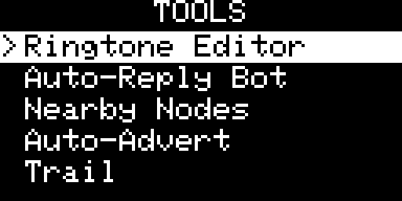

## Tools Screen

[Go back](../../../README.md)

### Overview

|           OLED            |           E-Ink           |
| :-----------------------: | :-----------------------: |
|  |  |

The Tools home card is a flat list of the utilities included in this focused Wio Tracker build. Navigate with **UP/DOWN** and press **Enter** to open the selected tool. **Cancel/Back** from the tool returns directly to the home carousel.

| Tool | Purpose |
| ---- | ------- |
| Nodes | Browse recently advertised nodes, inspect their details, ping known nodes, manage contacts and run discovery scans |
| Repeater | Configure repeating, standard radio timing and duplicate suppression when support is compiled in |
| Ringtone Editor | Edit and preview the notification melody |
| Diagnostics | Inspect device, radio, mesh and runtime information |

Map, Trail, Live Share, Locator, Compass, Remote Bot, GPIO, Clock Tools and on-device remote Admin are not included in this build.

---

## Nearby Nodes

Browse nodes that have recently advertised on the mesh. **LEFT/RIGHT** changes the type filter and **UP/DOWN** selects a node.

| Filter | Shows |
| ------ | ----- |
| All | All known nodes |
| Fav | Favourited contacts only |
| Comp | Companion/chat nodes |
| Rpt | Repeaters |
| Room | Room servers |
| Snsr | Sensor nodes |

Press **Enter** to inspect the selected node. **Hold Enter** opens the available actions for that entry:

- **Ping** — send a direct mesh ping when a public key is known.
- **Add contact / Favourite / Unfavourite / Delete contact** — manage stored contacts where applicable.
- **Sort: Dist/Recent** — change the stored-node ordering.
- **Discover scan / Rescan** — find zero-hop repeaters, sensors and room servers.

---

## Repeater

When repeater support is enabled, it always uses the current radio settings from **Settings › Radio**. The Repeater screen contains only the **Repeater** on/off control. Operation continues in the background after leaving Tools. Adverts and valid message floods are forwarded without user-defined SNR or global hop filters; automatic loop detection and the standard eight-hop advert limit remain active.

Its radio timing follows the standard MeshCore repeater backend and is fixed:
**RX delay** is `10`, **Flood TX** and **Direct TX** use airtime factors of `0.5`
and `0.3`, and **Yield** is `x2`. Multi-ACK behaviour is shared with the
companion's existing radio configuration.

Duplicate suppression is always **ON**. Together with the fixed Yield, this gives
another repeater time to forward a flood first and cancels the pending duplicate
when that retransmission is overheard.

---

## Ringtone Editor

Edit the notification melody, tempo and notes, then preview it through the device buzzer. Saving updates the ringtone used for message notifications.

---

## Diagnostics

View read-only device, radio, mesh and runtime statistics. **LEFT/RIGHT** changes diagnostic tabs and **UP/DOWN** scrolls when a tab does not fit on screen.
