## Tools Screen

[Go back](../../../README.md)

### Overview

|           OLED            |           E-Ink           |
| :-----------------------: | :-----------------------: |
|  |  |

The Tools screen is a hub for GPS trail recording, nearby node browsing, ringtone editing, auto-reply bot, and auto-advert. Navigate the tool list with **UP/DOWN** and press **Enter** to open a tool.

---

## Nearby Nodes

|           OLED            |           E-Ink           |
| :-----------------------: | :-----------------------: |
| 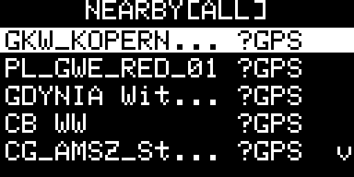 | 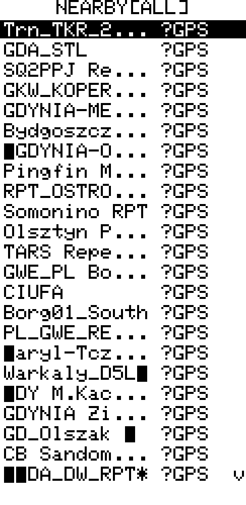 |

Browse nodes that have recently advertised on the mesh. Filter by category with **LEFT/RIGHT**:

| Filter | Shows                          |
| ------ | ------------------------------ |
| Fav    | Upstream-starred contacts only |
| ALL    | All known nodes                |
| Comp   | Companion (chat) nodes         |
| Rpt    | Repeaters                      |
| Room   | Room servers                   |
| Snsr   | Sensors                        |

Select a node to see its coordinates, distance, bearing with cardinal direction, type, and last-heard time.

From the list view, **Hold Enter** opens the context menu, where **Discover nearby** sends a live `NODE_DISCOVER_REQ` scan.

From either node detail view, **Hold Enter** opens the Ping popup:

|              OLED              |             E-Ink              |
| :----------------------------: | :----------------------------: |
| 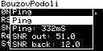 | 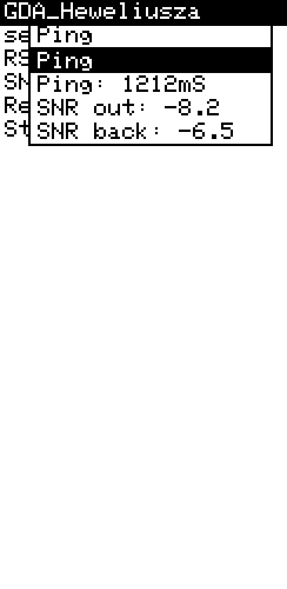 |

Use **Enter** on the popup’s `Ping` row to send a direct mesh ping to that node. The popup then shows the RTT and SNR values on the next lines, and can be used again immediately for another ping.

> [!TIP]
> Combined with **Auto-Advert** on the other device, Nearby Nodes becomes a passive location tracker — as long as the tracked device periodically broadcasts its GPS position, you can see its current distance and bearing without any manual interaction on either end.

---

### Active Discovery

|           OLED            |           E-Ink           |
| :-----------------------: | :-----------------------: |
| 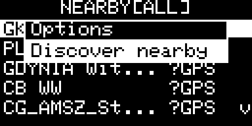 | 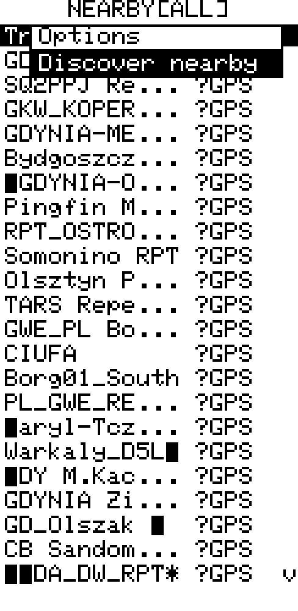 |

Sends a `NODE_DISCOVER_REQ` ping. Repeaters, sensors and room servers within zero-hop range respond immediately with name, type and signal data.

Results show as 2-line cards: node name + type, then RSSI / SNR / remote SNR.

- **UP/DOWN** — navigate results
- **Enter** — open full-screen detail (public key, signal data, contact status)
- **Hold Enter** — rescan
- **Hold Enter** in full-screen detail — open the Ping popup for the selected node
- **Cancel / Back** — return to nearby list

---

## GPS Trail

|           OLED            |           E-Ink           |
| :-----------------------: | :-----------------------: |
| 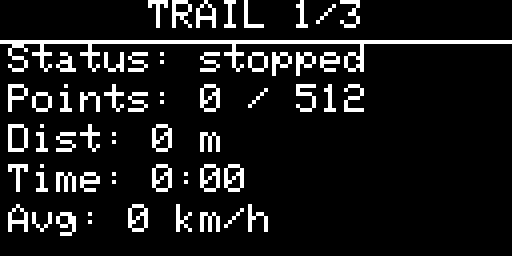 | 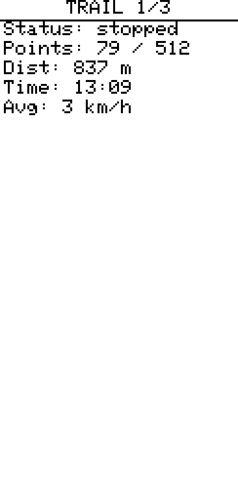 |

Records your route in a RAM ring buffer (up to 512 points, sampled every 1 s). Tracking runs in the background — a blinking **G** appears in the status bar. The trail survives display auto-off but is lost on reboot unless saved to flash first.

Cycle views with **LEFT / RIGHT**:

| View        | Content                                                                                                                                                             |
| ----------- | ------------------------------------------------------------------------------------------------------------------------------------------------------------------- |
| **Summary** | Distance, elapsed time, avg speed or pace, point count, tracking status                                                                                             |
| **Map**     | Auto-fit dot-and-line plot with cos(lat) aspect correction; segment breaks marked; north arrow; scale grid (toggle with **LEFT/RIGHT** on the Grid row in the menu). Your **current GPS position** and all **waypoints** are always drawn — even with no trail recording — so the map is useful standalone |
| **List**    | Per-point rows showing local time (HH:MM) and delta distance from the previous point; segment-start rows show `start`; scroll with **UP/DOWN**                      |

|           OLED            |           E-Ink           |
| :-----------------------: | :-----------------------: |
| 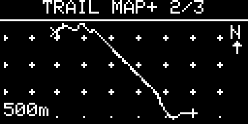 | 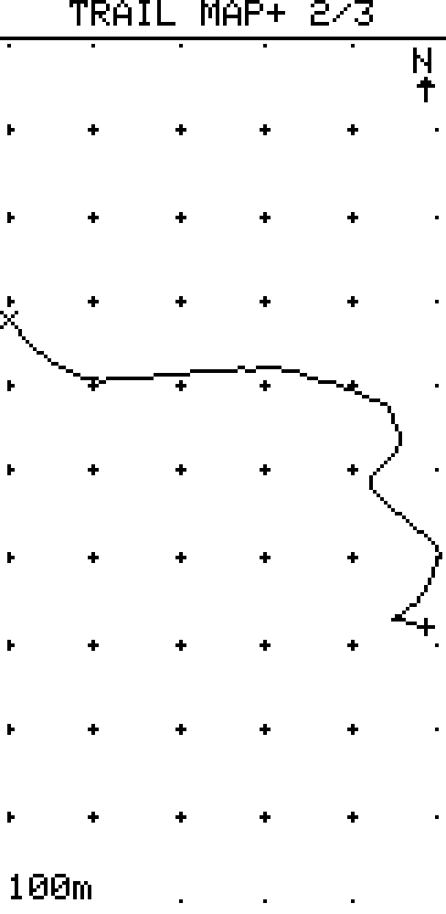 |

**Hold Enter** opens the action menu:

| Item                  | Interaction         | Action                                              |
| --------------------- | ------------------- | --------------------------------------------------- |
| Min dist              | LEFT/RIGHT          | Sample gate, 4 levels — metric: 5/10/25/100 m, imperial: 15/30/75/300 ft |
| Readout               | LEFT/RIGHT or Enter | Summary shows Speed or Pace (in the global unit system) |
| Grid                  | LEFT/RIGHT or Enter | Toggle scale grid on the map                        |
| Mark here             | Enter               | Drop a waypoint at the current GPS fix (see below)  |
| Add by coords         | Enter               | Add a waypoint from a lat/lon/label form — no GPS fix needed |
| Waypoints             | Enter               | Open the waypoint list / navigation                 |
| Start / Stop tracking | Enter               | Begin or end a recording session                    |
| Save trail            | Enter               | Write RAM ring to flash (`/trail`)                  |
| Load trail            | Enter               | Restore flash trail into RAM                        |
| Export (live)         | Enter               | Stream live RAM trail as GPX 1.1 over USB Serial    |
| Export (saved)        | Enter               | Stream saved flash trail as GPX 1.1 over USB Serial |
| Clear waypoints       | Enter               | Delete all saved waypoints (trail untouched)        |
| Reset trail           | Enter               | Clear RAM ring and elapsed time                     |

(Mark here / Waypoints / Clear waypoints appear only when applicable — e.g. with a GPS fix, or once at least one waypoint or trail point exists.)

### Waypoints

A waypoint is a saved spot — your car, camp, a water source — that you can navigate back to later. Waypoints are **independent of the trail**: they live in their own flash file (`/waypoints`), survive a reboot, and are **not** cleared by *Reset trail*. Up to 16 can be stored.

**Dropping a waypoint** — **Hold Enter → Mark here**. This captures the current GPS fix and opens the on-screen keyboard for a short label (up to 11 characters — e.g. `CAR`, `CAMP`, `H2O`). Leaving it blank auto-names it `WP1`, `WP2`, … Marking works whether or not the trail is being recorded; it needs a GPS fix (otherwise it reports *No GPS fix*).

**Adding by coordinates** — **Hold Enter → Add by coords** lets you create a waypoint without being there — no GPS fix required (handy for a meeting point or a spot read off a map). It opens a small form with three editable rows plus **Save**:

- **Lat** / **Lon** — **Enter** opens the keyboard to type the value in decimal degrees (magnitude only; the keyboard has no minus sign), and **LEFT/RIGHT** toggles the hemisphere — N/S for latitude, E/W for longitude.
- **Label** — **Enter** to type a name (blank → auto `WP<n>`).
- **Save** — validates the range and stores the waypoint. Missing or out-of-range values report a brief error.

**On the map** — saved waypoints show on the Trail Map view as a hollow diamond with the label's first two characters beside it (enough to tell nearby waypoints apart). Waypoints and your current GPS position are drawn continuously — even with no trail recording in progress — so the Map view doubles as a live "you + your marks" view, not just a recorded-track plot. With **no trail**, the view auto-fits to your waypoints and position. **While a trail exists**, the view frames the recorded route instead, and any waypoint that falls outside it is clamped to the nearest map edge — a distant mark can't blow up the scale and squash the trail.

**Navigating** — **Hold Enter → Waypoints** opens the list (each row shows the label and live distance). The list always begins with a synthetic **Trail start** row whenever a trail exists, so you can backtrack to where you began without having marked it. Select a row and press **Enter** to open the navigation view:

```
   CAMP            ← target label
   1.4 km          ← distance to target
   To:  145° SE    ← absolute bearing to the target
   Hdg: 090° E     ← your current course over ground (-- when stationary)
```

There is no magnetometer, so the screen shows two *absolute* bearings and you compare them: target at 145°, travelling at 90° → bear right. The **Hdg** line is derived from GPS movement (see Compass) and reads `--` until you move.

**Managing** — **Hold Enter** on a waypoint row offers **Rename** / **Delete** / **Send** (the *Trail start* row is navigate-only). **Hold Enter → Clear waypoints** on the Trail screen wipes them all at once.

**Sharing** — **Send** hands the waypoint to the Messages screen: pick a contact or channel, and the message is pre-filled as `[WAY]<lat>,<lon> <label>` (e.g. `[WAY]37.42123,-122.08456 CAR`) for you to confirm or edit before sending. On the receiving device, opening that message and **Hold Enter → Navigate / Save waypoint** turns it back into a navigable point (see *Messages › Fullscreen message view*). The format is plain text, so it stays readable on other firmware and the phone app.

### Downloading GPX

**Recommended — `tools/trail_export.py`** (auto-detects the port, captures from `<?xml` to `</gpx>`, writes a timestamped file under `tools/gpx/`):

```sh
uv run tools/trail_export.py
```

Then on the device: **Tools › Trail** → **Hold Enter** → **Export (live)** or **Export (saved)**.

**Manual fallback** — open a serial terminal at **115200 baud** and capture the stream by hand:

- **macOS/Linux** — `cat /dev/tty.usbmodem* > track.gpx` (stop with Ctrl-C after the dump finishes)
- **Windows** — PuTTY (Serial, 115200) or Arduino IDE Serial Monitor with no line ending; copy the text from `<?xml` to `</gpx>` into a `.gpx` file

Either way, the resulting file imports into OsmAnd, Garmin BaseCamp, GPX Studio, Google Earth, etc.

> [!NOTE]
> If the companion app is connected via **BLE**, the export is safe — BLE and USB operate independently. If connected via **USB**, disconnect the app before exporting.

---

## Auto-Advert

Periodically broadcasts a 0-hop advert with your GPS position. Configurable interval: off / 30 s / 1 min / 2 min / 5 min / 10 min / 30 min / 1 h. A blinking **A** appears in the status bar while active.

---

## Compass

A heads-up GPS compass. The L1 has no magnetometer, so the heading is the **course over ground** — derived from how your GPS position moves over the last few seconds. The display is a horizontal **heading tape**: a fixed travel-direction pointer sits at the centre and the N..E..S..W scale scrolls underneath it as you turn, so whatever is under the pointer is your current course. A large numeric readout below shows that course in degrees and cardinal (e.g. `145° SE`).

Because the heading comes from movement, it only updates while you are actually moving: standing still shows *move to set heading* (and navigation's **Hdg** line reads `--`). Gross GPS jumps are rejected so a single bad fix can't swing the heading. The heading source runs whenever there's a GPS fix — recording a trail is **not** required.

---

## Ringtone Editor

|           OLED            |           E-Ink           |
| :-----------------------: | :-----------------------: |
| 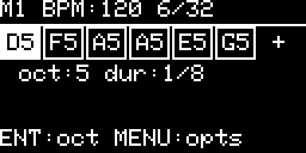 | 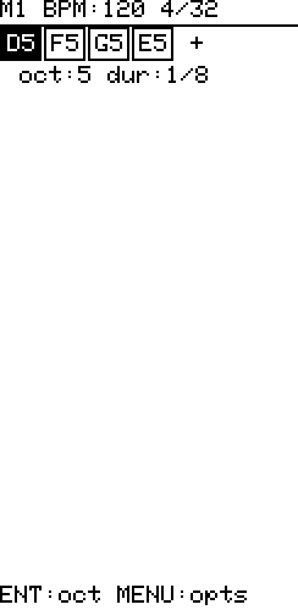 |

A step sequencer for composing custom notification melodies. Two slots — **Melody 1** and **Melody 2** — switchable from within the editor.

Each melody supports up to 32 notes:

| Parameter | Options                           |
| --------- | --------------------------------- |
| Pitch     | C / D / E / F / G / A / B / pause |
| Octave    | 4 – 7                             |
| Duration  | 1/4 / 1/8 / 1/16 / 1/32           |
| BPM       | 60 / 90 / 120 / 150 / 180         |

**Navigation in the editor:**

- **LEFT/RIGHT** — move between notes
- **UP/DOWN** — change pitch of selected note
- **Enter** — cycle octave of selected note
- **Hold Enter** (or context menu) — open options menu

**Options menu:**

| Item         | Interaction | Action                                 |
| ------------ | ----------- | -------------------------------------- |
| Play / Stop  | Enter       | Preview the melody                     |
| Melody 1 / 2 | Enter       | Switch to the other slot               |
| Duration     | LEFT/RIGHT  | Cycle duration for selected note       |
| BPM          | LEFT/RIGHT  | Cycle tempo                            |
| Insert       | Enter       | Insert a new note after the cursor     |
| Delete       | Enter       | Delete the note at cursor              |
| Save & Exit  | Enter       | Persist the melody and return to Tools |
| Discard      | Enter       | Return to Tools without saving         |

Melodies can be assigned in **Settings › Sound** (global default) or overridden per contact or channel from the Messages screen context menu.

---

## Auto-Reply Bot

|           OLED            |           E-Ink           |
| :-----------------------: | :-----------------------: |
| 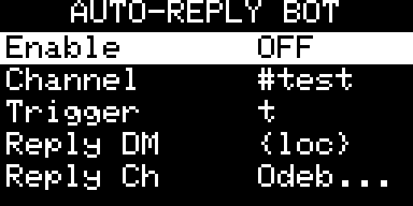 |  |

Automatically replies to incoming messages that contain a configured trigger word (case-insensitive, contains match).

When the bot is enabled it listens to DMs by default. Channel monitoring is an optional addition — select a channel separately to activate it alongside DM mode.

| Setting       | Description                                                                      |
| ------------- | -------------------------------------------------------------------------------- |
| Bot           | ON / OFF — enables DM listening                                                  |
| Channel mode  | ON / OFF — additionally monitors a selected channel                              |
| Channel       | Which channel to monitor (only relevant when channel mode is ON)                 |
| Trigger       | Word or phrase that activates the reply (shared by both modes, case-insensitive) |
| DM reply      | Reply text for DMs; supports `{time}` and `{loc}` placeholders                   |
| Channel reply | Reply text for channel messages; supports `{time}` and `{loc}` placeholders      |

A 10-second cooldown prevents repeated replies in quick succession.
