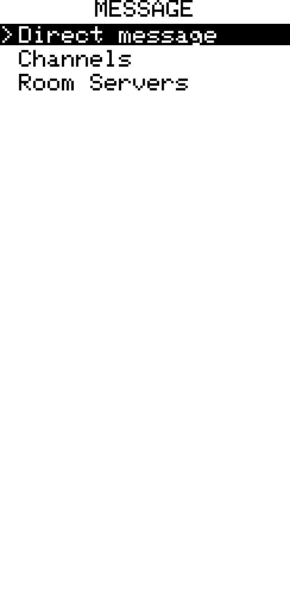
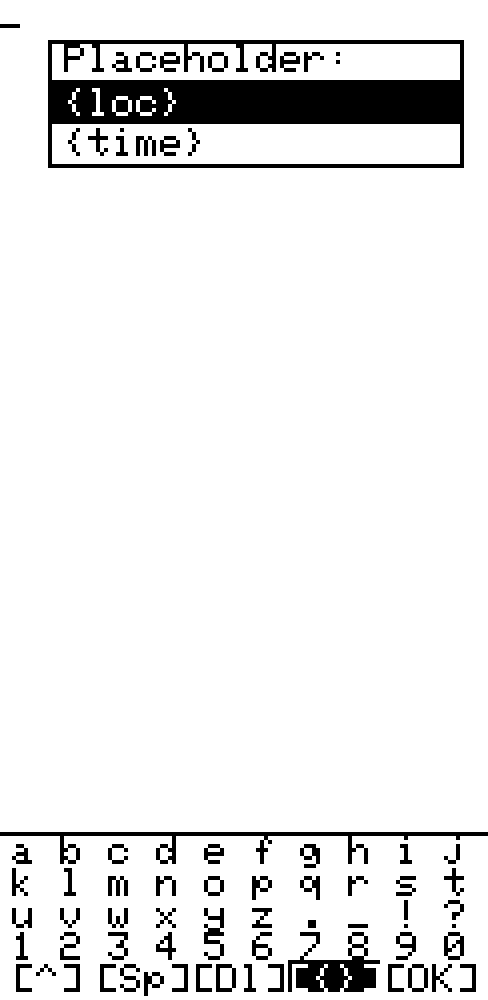
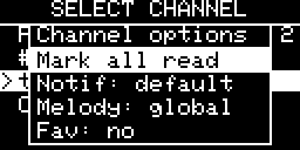

## Messages Screen

[Go back](../../../README.md)

### Overview

|           OLED            |           E-Ink           |
| :-----------------------: | :-----------------------: |
|  |  |

The Messages page on the main carousel is the recipient-category menu. It shows
**Direct Message**, **Channel** and **Room Servers**, including their unread
badges. Select a category with **UP/DOWN** and press **Enter** to open its list;
there is no separate "Press Enter to open" landing card.

Hold **Enter** (or press the context-menu key) on a category to open its menu.
Select **Mark all read** to clear the unread count for that category only.

---

### Child Mode

When [Child Mode](../child_mode/child_mode.md) is locked, the conversation lists contain only upstream-starred contacts and rooms, plus favourited channels. Contact, room, and channel context editing is disabled. Contacts already pinned to the optional Favourites Dial can also be opened directly.

Configure and favourite the allowed conversations before enabling Child Mode.

---

### Sending messages

|           OLED            |           E-Ink           |
| :-----------------------: | :-----------------------: |
|  |  |

Press **Enter** on a contact or channel to open its history. In the history,
press **Enter** to compose a custom message or hold **Enter** to open the quick
message list.

- **Custom message** — opens the on-screen keyboard
- **Q1–Q10** — quick reply templates editable in Settings › Messages

The editor enforces MeshCore's encoded message limit as text is entered. UTF-8
characters and emoji consume their actual encoded byte length, so they may use
more capacity than plain ASCII while still moving and deleting as one glyph.

While typing, **UP** from the top letter row enters cursor mode (LEFT/RIGHT move the insertion point; UP/DOWN jump to start/end, then continue on to the special row / letter grid if pressed again once already there; Enter/Cancel exit immediately from anywhere) so you can edit or insert in the middle of what you've typed instead of only at the end. **Hold Enter** opens completion choices in message fields. See the [Zen UI framework guide](../../design/zen_ui_framework.md) for the shared keyboard behaviour.

Message editors also provide a small emoji picker. Select the smiley key on the
keyboard, or press **Fn+M** on CardKB, then choose 👍, 👎, 🙂, or 🙁. Emoji count
against the encoded message byte limit; each entry behaves as one character for
cursor movement and Backspace.

The keyboard supports placeholders that insert live data at send time:

| Placeholder | Value                | Availability                |
| ----------- | -------------------- | --------------------------- |
| `{time}`    | current time (HH:MM) | always                      |
| `{loc}`     | GPS coordinates      | always ("no GPS" if no fix) |
| `{temp}`    | temperature          | sensor connected            |
| `{hum}`     | humidity             | sensor connected            |
| `{pres}`    | barometric pressure  | sensor connected            |
| `{alt}`     | altitude             | sensor connected            |
| `{lux}`     | luminosity           | sensor connected            |
| `{co2}`     | CO₂ concentration    | sensor connected            |

Sensor placeholders appear automatically when the corresponding sensor is
active. Time and location expansion remain available to quick-message templates,
but are not mixed into the normal word-completion list.

In channel and room transcripts, replying to a particular received message
pre-fills an `@[name] ` prefix so other participants can see who is being
addressed. Direct-message replies do not need the prefix.

---

### Rooms — logging in

Posting to a **room server** requires a login handshake first, so the device can log in on its own — no phone app needed. The first time you press **Enter** on a room, a password prompt opens automatically; type the room's password and press the **✓** key (leave it empty and submit for open / no-password rooms). Once the login succeeds the room's chat **opens automatically** — no second Enter needed (as long as you're still on that room in the list).

- **Passwords are remembered across reboots.** After a successful login the password is saved on the device, so picking that room again — even after a power cycle — logs back in silently and drops you straight into the chat.
- **A wrong or changed password self-heals.** If a saved password stops working (e.g. the server's password was changed), the failed login forgets it, so the next **Enter** prompts you to type a new one.
- **Re-login any time** with **Hold Enter** on the room → **Login…** (see the room context menu below) — useful to switch to a new password without waiting for a failure.
- **Log out** with **Hold Enter** on a room you're currently logged into → **Logout** (only offered once logged in). Forgets the saved password on the device, so the next time you open that room it prompts for one again instead of silently reusing the old one.
- Passwords set from the **phone app** are saved on the device too, so it can post to that room standalone after a reboot.

> The on-screen keyboard is EN-US. The initial emoji picker is available
> locally; other characters can still be entered from the
> phone app and are stored and replayed byte-for-byte.

---

### Message history

|           OLED            |           E-Ink           |
| :-----------------------: | :-----------------------: |
|  |  |

Direct messages, room posts and channel posts use the same full-width transcript
layout. Sender names are inverted, the compact age (`3m`, `2h`, `>1d`) appears
on the sender row, and a horizontal rule separates messages. The newest content
starts at the bottom.

Outgoing delivery markers show both route and state. `D` means zero-hop direct,
`P` means a stored repeater path and `F` means flood. While waiting, the number
is the total transmission count (`P1`, `P2`, `F3`, etc.). A confirmed delivery
uses the latest route plus a tick (`F✓`); an exhausted direct-message send shows
`✗`. Channels instead count matching repeater echoes heard during a six-second
window: `1✓`, `2✓`, etc. Zero echoes becomes `✗`; this does not prove that no
recipient heard the original transmission.

Use **UP/DOWN** to scroll one wrapped line at a time. Long messages continue
through the viewport instead of being truncated or requiring a separate reader;
scrolling up eventually reveals the sender row and every earlier line. The same
layout and navigation apply to direct messages, rooms and channels.

Press **Enter** to compose a custom message. In a channel or room, hold
**Enter** and choose **Reply to…** to select one of the six most recent unique
participants in that transcript. The picker is newest-first, excludes your own
messages and opens the editor with `@[name] ` already inserted. Reply messages
show a compact `To: name` row in history. These remain ordinary group messages;
the prefix identifies the intended participant but does not make delivery
private. Hold **Enter** also provides **Quick messages**.

If the newest outgoing direct or room message exhausts automatic delivery
attempts, hold **Enter** in its transcript and choose **Resend failed**. For
channels the equivalent action is **Resend anyway**, because a missing repeater
echo is not proof that every recipient missed the original packet.

Unread state is tracked per direct contact, room and channel. A message is
marked read immediately only when its matching transcript is physically visible
on an unlocked display. Messages received while the display is off or the lock
screen is shown remain unread until that transcript is rendered after wake.
Retransmitted copies of the same direct or room message do not create another
history entry, unread count or notification.

When an eligible notification wakes an otherwise sleeping display, the display
turns off again after five seconds unless the user presses a Tracker button. A
notification received while the display is already on does not shorten the
normal display timeout.

Direct-message delivery is automatic and has no user-adjustable retry setting.
With a known path Zen sends once on that path, retries it once, clears the stale
path, then makes up to three flood attempts. Without a known path it makes up to
three flood attempts in total. An ACK ends the sequence immediately.

---

### Context menu — contact list

**Hold Enter** on a contact entry opens a context menu:

|           OLED            |           E-Ink           |
| :-----------------------: | :-----------------------: |
|  |  |

| Item                         | Action                                                                         |
| ---------------------------- | ------------------------------------------------------------------------------ |
| Mark as read                 | Clears unread counter for this contact                                         |
| Notif: Default / Off / On    | Per-contact notification override — **LEFT/RIGHT** to cycle                    |
| Melody: Global / M1 / M2     | Per-contact melody override — **LEFT/RIGHT** to cycle                          |
| Pin to dial / Unpin (slot N) | Pin this contact to a Favourites Dial slot; if already pinned shows which slot |

When **Pin to dial** is selected, a slot picker opens (Slot 1–4 showing the
current occupant name or "empty"). Choosing an occupied slot replaces it and
moves an already-pinned contact rather than duplicating it.

In the **Rooms** list the context menu instead offers:

| Item    | Action                                                                       |
| ------- | ---------------------------------------------------------------------------- |
| Login…  | Opens the password prompt to (re-)log in to this room (see Rooms — logging in) |
| Logout  | Only shown once logged in. Forgets the saved password so the next open prompts for one again |

---

### Context menu — channel list

|           OLED            |           E-Ink           |
| :-----------------------: | :-----------------------: |
|  |  |

**Hold Enter** on a channel entry opens a context menu:

| Item                      | Action                                                                |
| ------------------------- | --------------------------------------------------------------------- |
| Mark all read             | Clears all unread for this channel                                    |
| Notif: Default / Off / On | Per-channel notification override — **LEFT/RIGHT** to cycle           |
| Melody: Global / M1 / M2  | Per-channel melody override — **LEFT/RIGHT** to cycle                 |
| Fav: Yes / No             | Add or remove this channel from favourites — **LEFT/RIGHT** to toggle |
| Edit                      | Opens the Add/Edit form below, pre-filled with the channel's name    |
| Delete                    | Removes the channel immediately (no confirm prompt)                   |

---

### Adding / editing a channel

Joining a new community channel, or creating one to share with others, no longer needs the phone app. The **Channels** list ends with a **"+ Add channel"** row — press **Enter** on it to pick a channel type, or use **Edit** from the context menu above to change an existing channel's name or secret (Edit skips the type picker and opens the Name/Secret form directly).

**+ Add channel** first asks which type of channel to create — the same three types the phone app offers:

- **Public** — instantly re-adds the well-known default public channel (no fields to fill in). Useful if it was deleted and you want it back without remembering its key.
- **Hashtag** — type a topic name (e.g. `test`); the channel's name and secret are both derived from it (name becomes `#test`, secret is the first 16 bytes of `sha256("#test")`). A topic-based public group chat — anyone who types the same topic elsewhere ends up on the same channel — separate from the default Public channel.
- **Private** — the manual Name + Secret form:

  | Field  | Notes                                                                                        |
  | ------ | ---------------------------------------------------------------------------------------------- |
  | Name   | Up to 31 characters                                                                            |
  | Secret | **LEFT/RIGHT** toggles between two entry modes; **Enter** opens the keyboard for whichever is selected |

  - **Passphrase** (default) — type any text; the device hashes it down to the channel's 16-byte secret. Easiest to agree on verbally, the same idea as a room password — two people who type the same passphrase end up on the same channel.
  - **Hex key** — type the exact 32-hex-character secret (the format used by channel QR codes, see [QR Codes](../../qr_codes.md)), for joining a channel whose precise secret you were given rather than agreeing on a new passphrase. An all-zero secret (`00…0`) is rejected ("Invalid secret") — that value is reserved internally to mark an empty channel slot.

  Select **[Save]** to commit. The secret can't be redisplayed once saved (only the derived key is kept) — editing it later means typing a new passphrase or hex key, the same as re-logging into a room with a new password.

---
